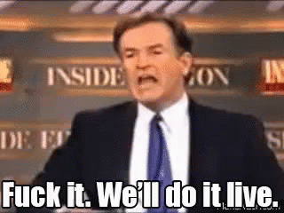

# Developer Tools

--

--

Pray to the demo gods

Notes:
Let's see how the browser developer tools can help us debug HTML and CSS issues

1. DOM manipulations
  - Rewriting HTML
  - Moving elements around
  - Deleting
  - `$0` element reference
2. Use the color picker
3. Debug pseudostates and toggle classes
4. Inspect flexbox
5. Inspect variables
6. Computed tab
  - Filtering
  - Show all and group
  - Rendered font
7. Properties tab
8. Making style changes
9. Tracking style changes
